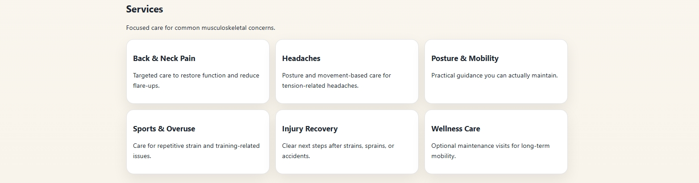
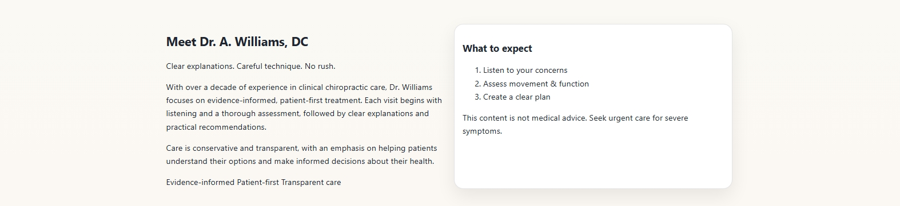
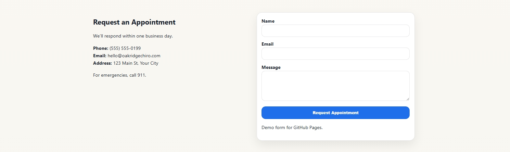
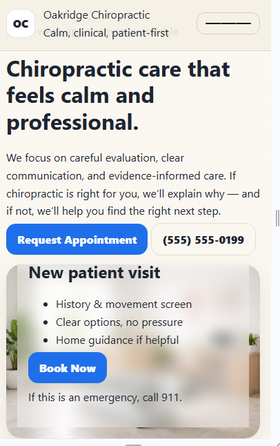
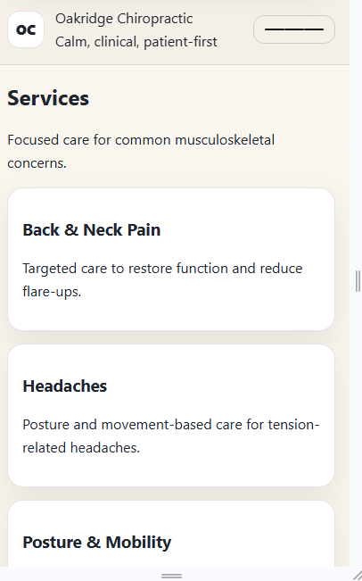

# Oakridge Chiropractic — Portfolio Website

## Overview
This project demonstrates a modern, calm, and professional website layout for a
chiropractic practice. The focus is on clarity, accessibility, and mobile usability
rather than heavy visuals or marketing language.

All business details are placeholders and used for demonstration purposes only.

## Project Goals
- Design a clean, healthcare-appropriate interface focused on trust and clarity
- Prioritize accessibility and mobile usability
- Create a calm visual hierarchy suitable for a medical setting
- Demonstrate thoughtful UX decisions for patient-facing content
- Keep the implementation lightweight and easy to maintain

## Screenshots

### Homepage (Desktop)

The homepage establishes a calm, professional first impression with clear messaging
and primary calls to action, emphasizing trust, clarity, and patient comfort.

### Services Overview (Desktop)

Services are presented in a clean, scannable layout designed to help patients
quickly understand available care without overwhelming detail.

### Meet the Chiropractor (Desktop)

The “Meet the Chiropractor” section focuses on credibility and patient-first care,
providing reassurance through clear expectations and a transparent treatment
approach.

### Hours & Contact (Desktop)

Contact information is organized for real-world usability, displaying hours, phone
number, location details, and an embedded map to reduce friction for new patients.

### Responsive Design (Mobile)

The layout was tested and adjusted for mobile devices to maintain readability,
accessible calls to action, and a smooth experience on smaller screens.

Service cards reflow vertically on mobile to preserve clarity and tap-friendly
interaction.

## Technologies Used
- HTML5
- CSS3
  - Responsive layout techniques
  - CSS variables for theme consistency
  - Mobile-first styling considerations
- GitHub Pages for hosting

No JavaScript frameworks were used to keep the project lightweight and easy to
maintain.

## Key Features
- Responsive design for desktop and mobile
- Clear navigation and call-to-action buttons
- Calm, healthcare-appropriate visual style
- Informational sections designed to reduce patient anxiety
- Appointment request form (demo only)
- Clean footer with portfolio disclaimer

## Design Approach
- Single-page layout to reflect small practice needs
- Emphasis on trust, clarity, and readability
- Minimal visual noise to reduce cognitive load
- Clear spacing and tap targets for mobile users
- Transparent communication over marketing-heavy language

## Disclaimer
This website is a portfolio demonstration project.
Practitioner names, contact details, and business information are placeholders unless
otherwise noted.

## Future Improvements
Potential enhancements could include:
- Expanded service detail pages
- Improved form validation and accessibility feedback
- SEO enhancements such as structured data
- Performance optimizations for images and assets

## Author
Aaron Williams  
Entry-Level Web Developer

This project was created to demonstrate practical front-end skills, attention to
detail, and thoughtful UX decisions for healthcare-oriented websites.
